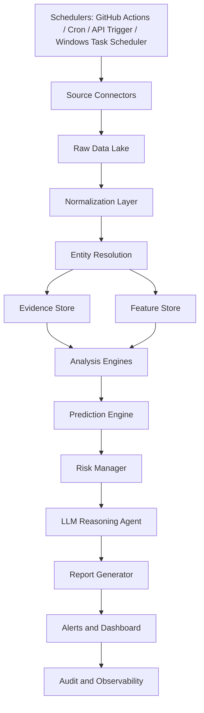

# ARCHITECTURE.md

## EagleSignal AI Architecture



## 1. Design Principles

- **Evidence-first:** No final prediction without evidence references.
- **Modular:** Every skill can be replaced without breaking the system.
- **Time-aware:** No lookahead bias, no stale data treated as fresh.
- **Risk-aware:** “No trade” is a valid output.
- **Explainable:** Scores must be decomposed into components.
- **Legal and ethical:** Use public, legal, authorized data sources.
- **Secure:** API keys must only be stored in environment variables or secret managers.

## 2. Core Components

### 2.1 Scheduler Layer

The local product supports `python -m eaglesignal collect`, `/jobs/run`, `/jobs/status`, and `scripts/install_windows_task.ps1` for every-two-hours collection while the laptop is on.

Runs workflows by schedule or event trigger.

Options:

- GitHub Actions
- Local cron
- Docker container
- FastAPI trigger endpoint
- Cloud scheduler

### 2.2 Source Connectors

Connectors should implement a common interface:

```python
class SourceConnector:
    def fetch(self, request):
        pass

    def validate(self, response):
        pass

    def normalize(self, response):
        pass
```

### 2.3 Raw Data Lake

Stores original responses for audit and reprocessing.

Recommended structure:

```text
data/raw/source_name/YYYY-MM-DD/entity/file.json
```

### 2.4 Normalization Layer

Converts raw source data into consistent schemas.

Schemas:

- `market_price`
- `options_contract`
- `sec_filing`
- `fundamental_fact`
- `news_article`
- `macro_series`
- `social_post`
- `event_record`
- `prediction_record`

### 2.5 Evidence Store

Stores every claim used by the AI.

Minimum fields:

```json
{
  "evidence_id": "uuid",
  "entity": "AAPL",
  "source_name": "SEC",
  "source_type": "official",
  "url": "...",
  "retrieved_at": "...",
  "published_at": "...",
  "claim": "Company filed new 10-Q",
  "raw_excerpt": "...",
  "reliability_score": 95,
  "freshness_score": 100
}
```

### 2.6 Feature Store

Stores features by entity and timestamp.

Feature examples:

- `rsi_14`
- `macd_histogram`
- `relative_volume`
- `iv_rank`
- `put_call_ratio`
- `revenue_growth_yoy`
- `debt_to_equity`
- `news_sentiment_score`
- `macro_regime_score`
- `sector_relative_strength`

### 2.7 Analysis Engines

Independent engines produce component scores:

- Technical score
- Price/volume score
- Fundamental score
- Options score
- Macro score
- News score
- Sentiment score
- Cross-market score
- Risk penalty

### 2.8 Prediction Engine

Combines rules, ML, and calibrated scores.

Recommended levels:

1. Rule-based baseline
2. Statistical baseline
3. Machine learning model
4. Ensemble score
5. LLM explanation layer

The LLM should explain and reason over evidence, but should not be the only predictor.

### 2.9 Risk Manager

Blocks or downgrades risky outputs:

- Illiquid options
- Very wide bid/ask spreads
- Earnings IV crush risk
- Major macro event pending
- Conflicting evidence
- Stale data
- Low source reliability
- No backtest support

### 2.10 Report Generator

Outputs:

- Markdown
- HTML
- JSON
- CSV

### 2.11 Alerting Layer

Supported channels:

- Email
- Slack
- Discord
- Telegram
- Webhook
- GitHub issue/comment artifact

### 2.12 Observability

Track:

- Source latency
- Failed requests
- Missing data
- Prediction confidence
- Prediction outcomes
- Backtest changes
- Alert counts
- Duplicate alerts suppressed

## 3. Suggested Tech Stack

| Layer | Suggested tools |
|---|---|
| Language | Python 3.11+ |
| Data | pandas, polars, pyarrow |
| Market data | yfinance for MVP, paid provider later |
| SEC | SEC EDGAR APIs/company facts |
| Macro | FRED, BLS, BEA |
| ML | scikit-learn, xgboost/lightgbm optional |
| Backtesting | vectorbt/backtesting.py/custom engine |
| API | FastAPI |
| Dashboard | Streamlit, Dash, or React later |
| Storage MVP | local files + SQLite/DuckDB |
| Storage production | Postgres + object storage |
| Scheduling | GitHub Actions / cron / Airflow later |
| Logging | structlog/loguru + JSON logs |
| Testing | pytest |
| Security | environment variables, secret scanning |

## 4. Data Contracts

Every module should exchange explicit schemas. Avoid passing random dictionaries without validation.

Use pydantic models for:

- `AssetEntity`
- `MarketBar`
- `OptionContract`
- `FundamentalFact`
- `FilingEvent`
- `NewsEvent`
- `MacroObservation`
- `SignalComponent`
- `PredictionResult`
- `RiskDecision`
- `ReportArtifact`

## 5. Scoring Architecture

Default weights:

```yaml
technical_structure: 15
price_volume_momentum: 15
fundamentals: 15
options_intelligence: 15
macro_regime: 10
news_events: 10
sentiment: 10
cross_market_correlation: 5
risk_penalty_adjustment: 5
```

The final confidence score should be different from the opportunity score.

- **Opportunity score:** How attractive the setup is.
- **Confidence score:** How reliable the evidence/model output is.
- **Risk score:** How dangerous the setup is.

## 6. Prediction Record Schema

```json
{
  "prediction_id": "uuid",
  "created_at": "timestamp",
  "ticker": "NVDA",
  "asset_type": "equity",
  "horizon": "5D",
  "direction": "bullish",
  "opportunity_score": 82,
  "confidence_score": 68,
  "risk_score": 41,
  "component_scores": {},
  "expected_move": {},
  "bullish_evidence_ids": [],
  "bearish_evidence_ids": [],
  "neutral_evidence_ids": [],
  "invalidation_conditions": [],
  "model_version": "v0.1.0",
  "data_versions": {},
  "disclaimer": "Research only, not financial advice."
}
```

## 7. Production Hardening Checklist

- [ ] Secrets are not committed.
- [ ] Every source has retry and rate-limit logic.
- [ ] Reports show missing/stale data.
- [ ] Backtests avoid lookahead bias.
- [ ] Options recommendations check spread and liquidity.
- [ ] Reports include disclaimers.
- [ ] Logs do not contain API keys.
- [ ] Alert deduplication works.
- [ ] Model version is stored.
- [ ] Prediction outcome tracking exists.
